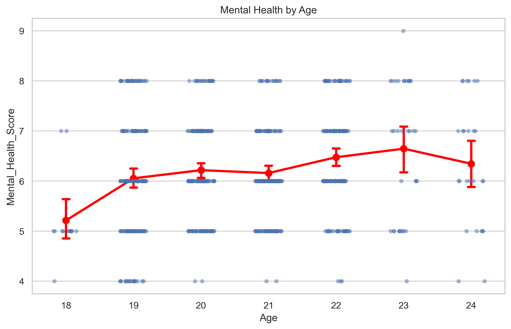
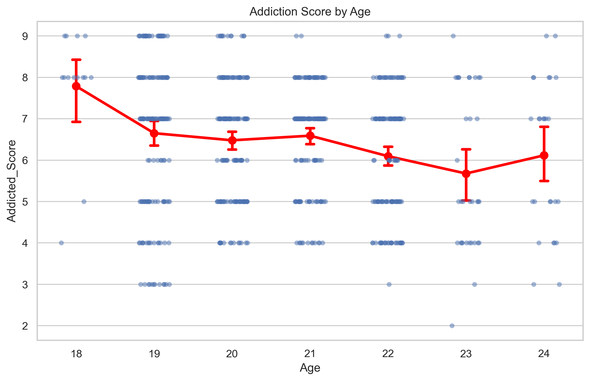

## Social-Media-and-Academic-Impact

## Overview
- This project explores how a series of behaviors related to digital presence impact academic performance.
- Data collected from self report questionnaire research on students of multiple countries.

##  Goals
- Conduct exploratory data analysis on student behavior data.
- Build and compare predictive models: Logistic Regression, Random Forest, XGBoost.
- Explore the trade-off between simple regression and complex ensemble models.

## Repository Structure
- `/Data` — Data files or instructions to obtain them.
- `/Images` — Visualizations: ROC curves, feature importance, correlation heatmaps.
- `/notebooks` — Full data analysis and model building notebooks.
- `/src` — Python scripts with reusable functions.

## Exploratory Data Analysis
- Mostly undergradute and graduate students 19 to 22 yrs old responded the research.
- Equal number of male and female students distributed in 'single', 'in a relationship' with minority group 'it's complicated'
- High daily usage of social media with serious mental health impacts and social media addicion reported

  

  

- Mental health increaes with age, lowest values on younger students.
- Addiction scores decreases with age, highest scores on younger students.
- Tendency show possible overdependency trend on younger students that slightly heals each following year.

  

  

