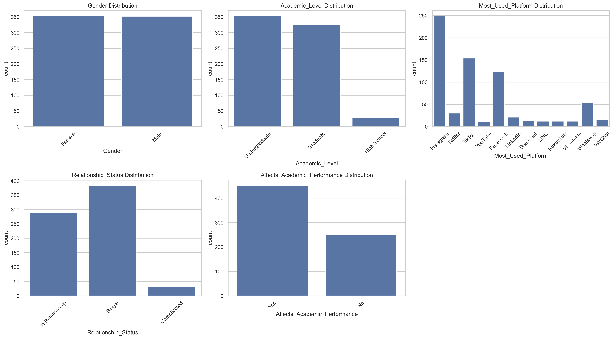
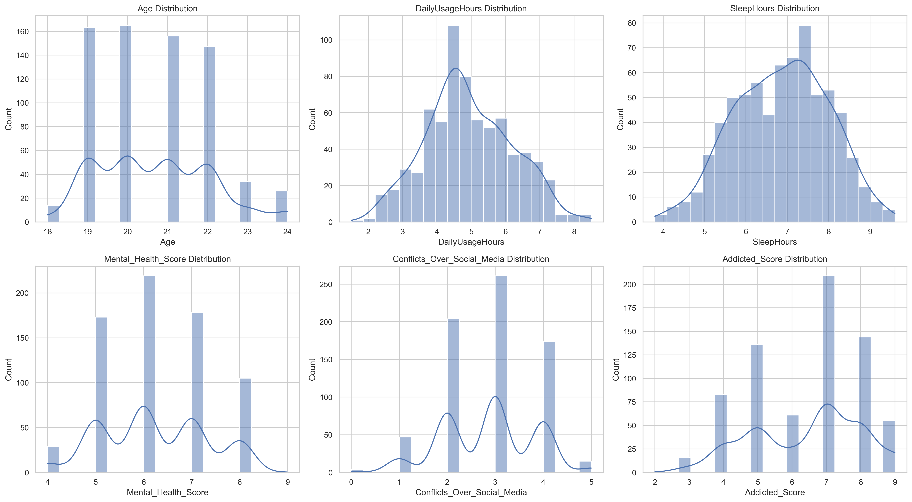
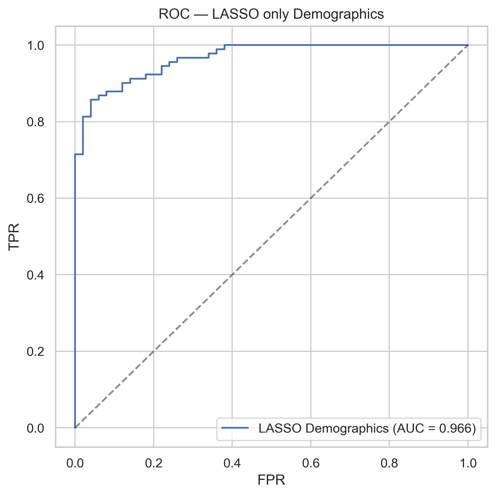
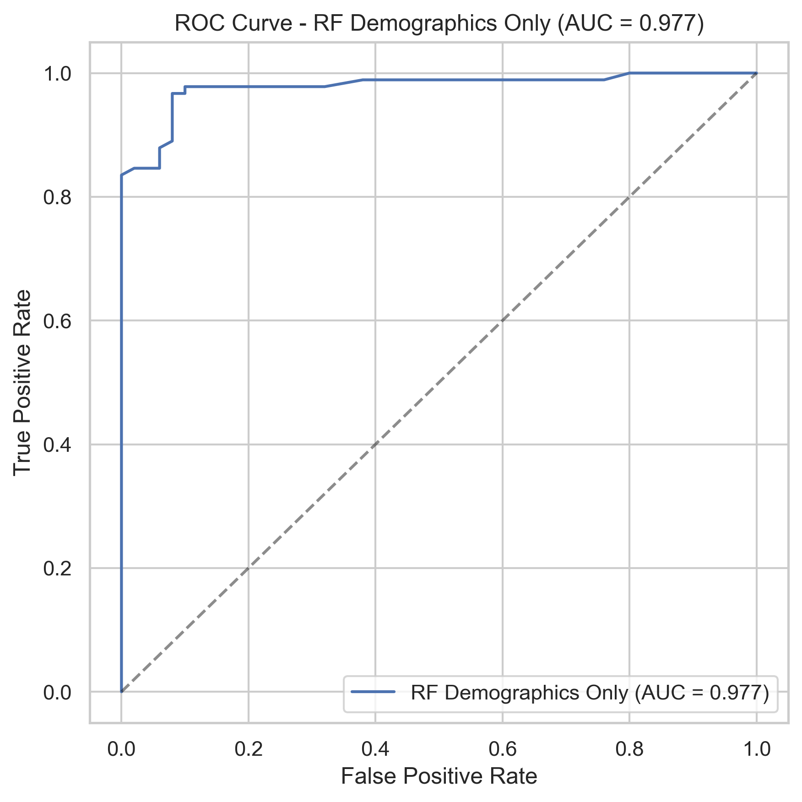
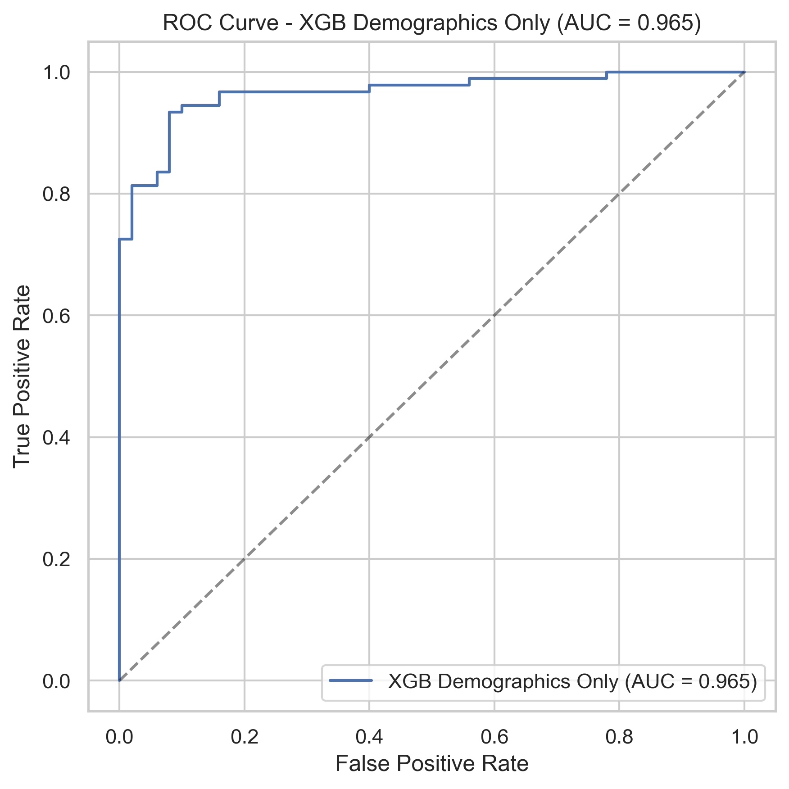

## Social-Media-and-Academic-Impact

## Overview
- This project explores how a series of behaviors related to digital presence impact academic performance.
- Data collected from self report questionnaire research on students of multiple countries.

##  Goals
- Conduct exploratory data analysis on student behavior data.
- Build and compare predictive models: Logistic Regression, Random Forest, XGBoost.
- Explore the trade-off between simple regression and complex ensemble models.

## Repository Structure
- `/Data` — Data files or instructions to obtain them.
- `/Images` — Visualizations: ROC curves, feature importance, correlation heatmaps.
- `/Notebooks` — Full data analysis and model building notebooks.
- `/Scripts` — Python scripts with reusable functions.

## Exploratory Data Analysis
- Mostly undergradute and graduate students 19 to 22 yrs old responded the research.
- Equal number of male and female students distributed in 'single', 'in a relationship' with minority group 'it's complicated'
- High daily usage of social media with serious mental health impacts and social media addicion reported

  

  

## Models and Results

### 1. Logistic Regression (LASSO)
- Baseline interpretable model.
- Clear and easy mathematical representation.
- AUC: **0.966**

  

### 2. Random Forest
- Captures non-linear patterns.
- Tends to assign broader importance across features.
- AUC: **0.977**

  

### 3. XGBoost
- Gradient-boosted trees.
- Highly efficient, but concentrates feature importance strongly.
- AUC: **0.965**

  

## Key Insights

- Models with only measurable demographic variables achieve surprisingly high performance, suggesting strong underlying patterns in usage behavior.
- Removing subjective variables like "Addiction Score" and "Conflicts over Social Media" reduces overfitting but maintains good predictive power.
- Variables like sleep hours, daily usage, and main platform are highly predictive to negative impact on academic performance.

